# 技术文档

---

## 1. 架构图（概要设计）

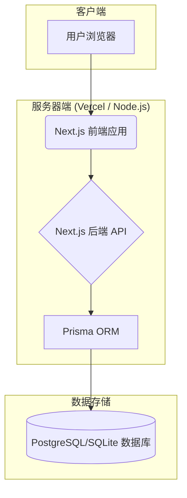

**描述:**
这是一个基于 Next.js 的全栈 Web 应用架构。
- **用户浏览器**: 用户通过浏览器访问应用。
- **Next.js 前端应用**: 负责UI渲染、用户交互，使用 React 构建。
- **Next.js 后端 API**: 处理业务逻辑、数据请求，通过 API Routes 实现。
- **Prisma ORM**: 作为数据库的抽象层，简化数据库操作。
- **数据库**: 存储应用数据 (例如用户信息、帖子、评论等)。

---

## 2. 时序图（分析） - 用户注册流程

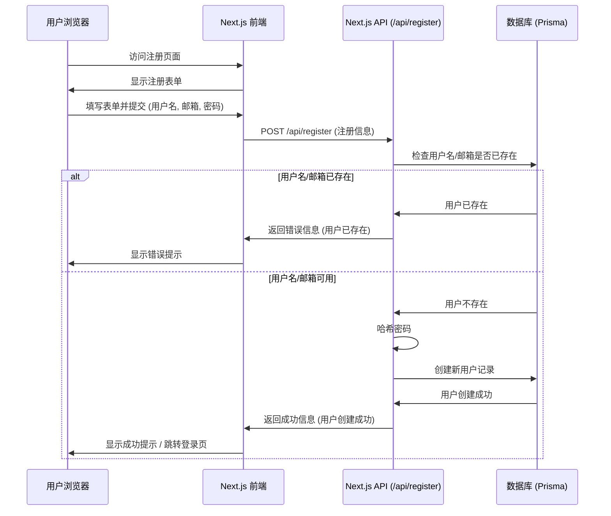

**描述:**
此图展示了用户注册功能的交互流程。

---

### 2.1 用户登录流程

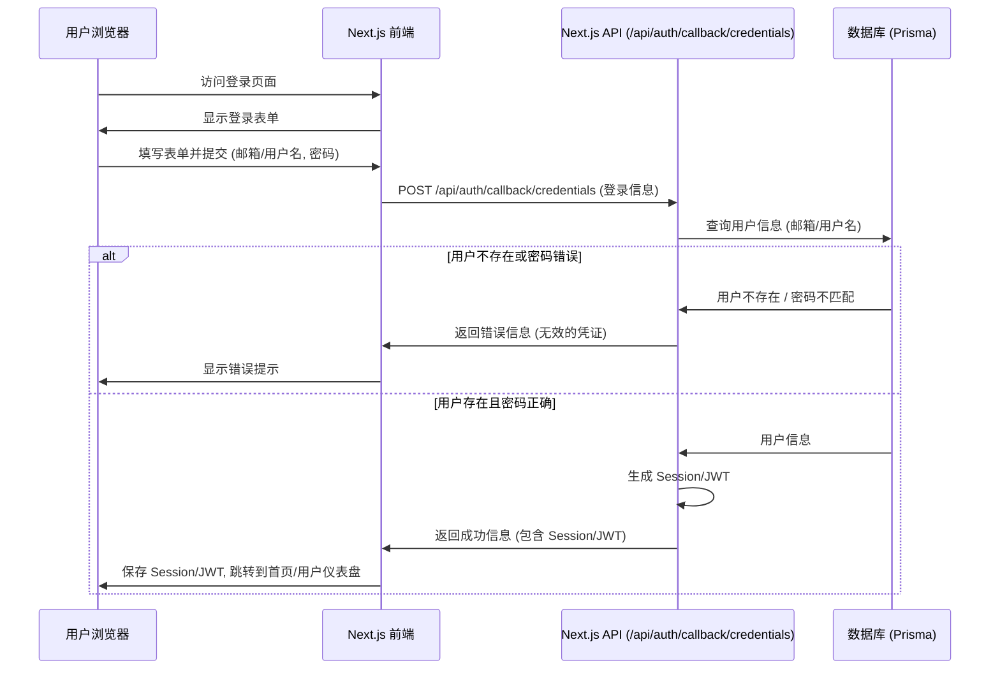

**描述:**
此图展示了用户登录功能的交互流程。

---

### 2.2 创建新帖子流程

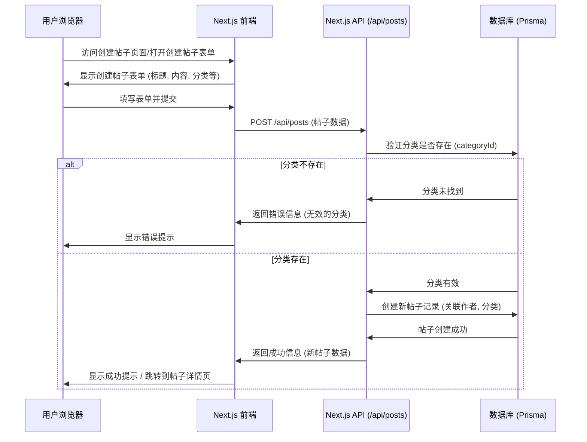

**描述:**
此图展示了用户创建新帖子的交互流程。

---

### 2.3 创建新评论流程

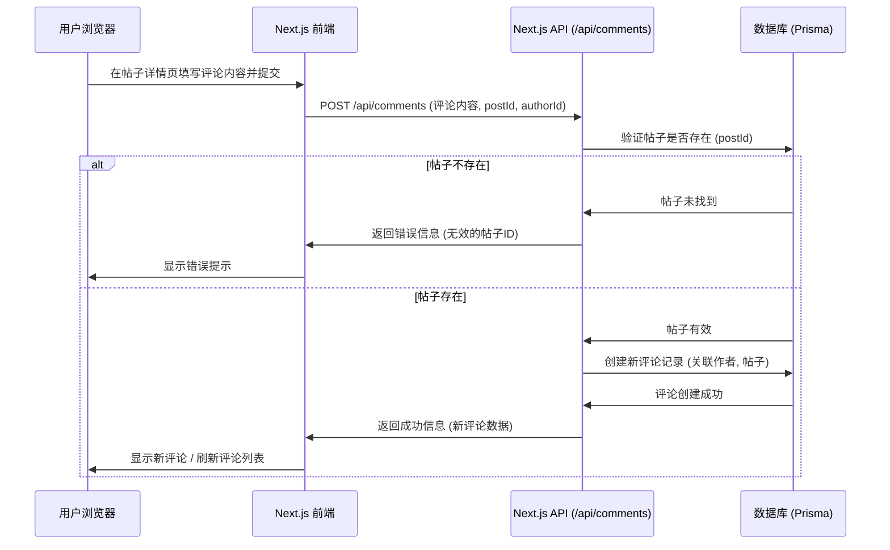

**描述:**
此图展示了用户创建新评论的交互流程。

---

### 2.4 读取帖子列表流程

```mermaid
sequenceDiagram
    participant User as 用户浏览器
    participant Frontend as Next.js 前端
    participant Backend as Next.js API (/api/posts)
    participant DB as 数据库 (Prisma)

    User->>Frontend: 访问首页/分类页/搜索结果页
    Frontend->>Backend: GET /api/posts (可选参数: categoryId, searchTerm, page, limit)
    Backend->>DB: 根据参数查询帖子列表 (分页, 排序)
    DB->>Backend: 返回帖子列表数据
    Backend->>Frontend: 返回帖子列表 (JSON)
    Frontend->>User: 显示帖子列表
end
```

**描述:**
此图展示了用户读取帖子列表的交互流程。

---

### 2.5 读取单个帖子详情流程

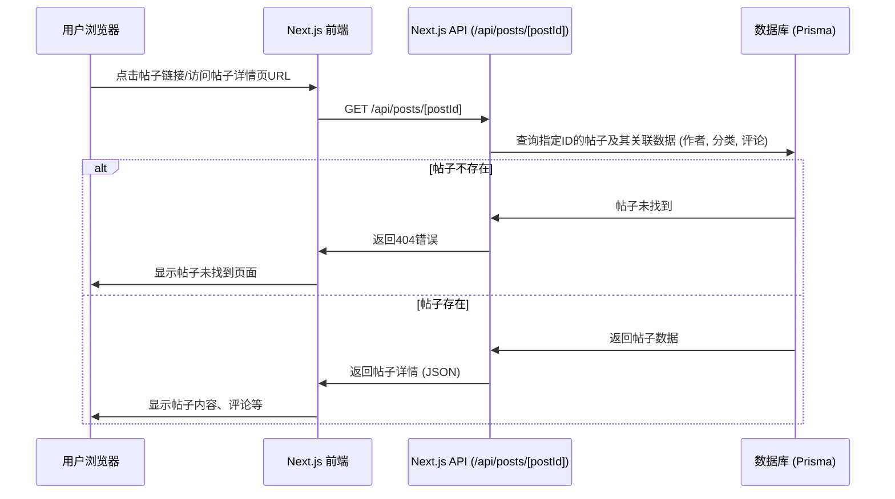

**描述:**
此图展示了用户读取单个帖子详情的交互流程。

---

### 2.6 更新帖子流程

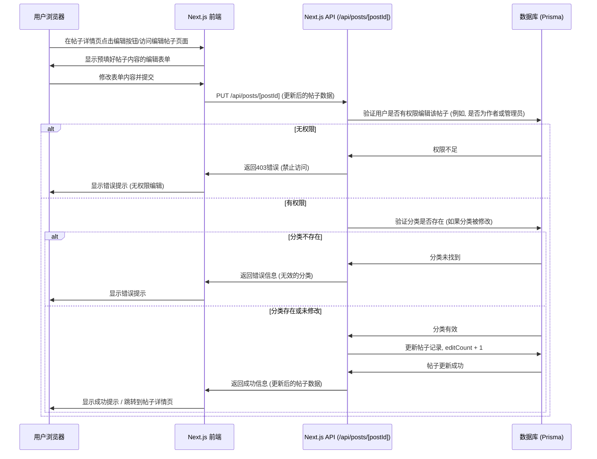

**描述:**
此图展示了用户更新帖子的交互流程。

---

### 2.7 删除帖子流程

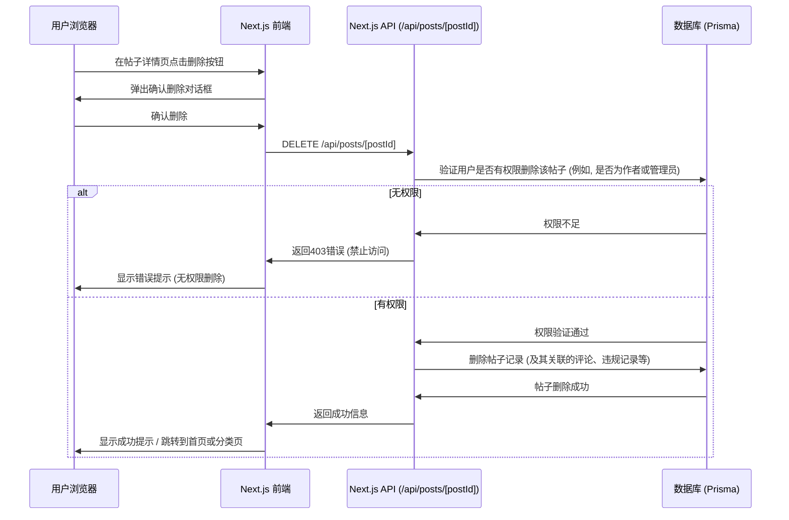

**描述:**
此图展示了用户删除帖子的交互流程。

---

### 2.8 更新评论流程

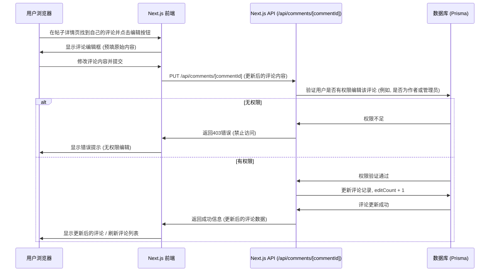

**描述:**
此图展示了用户更新评论的交互流程。

---

### 2.9 删除评论流程

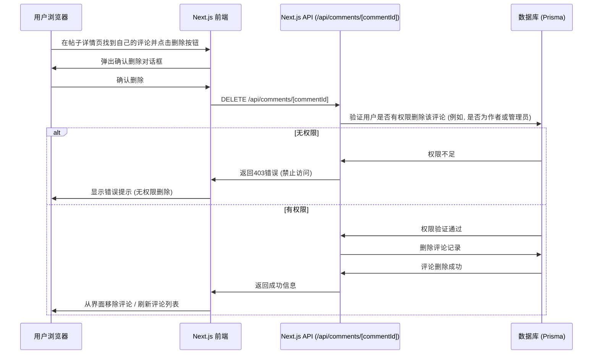

**描述:**
此图展示了用户删除评论的交互流程。

---

## 3. 类图（详细设计）

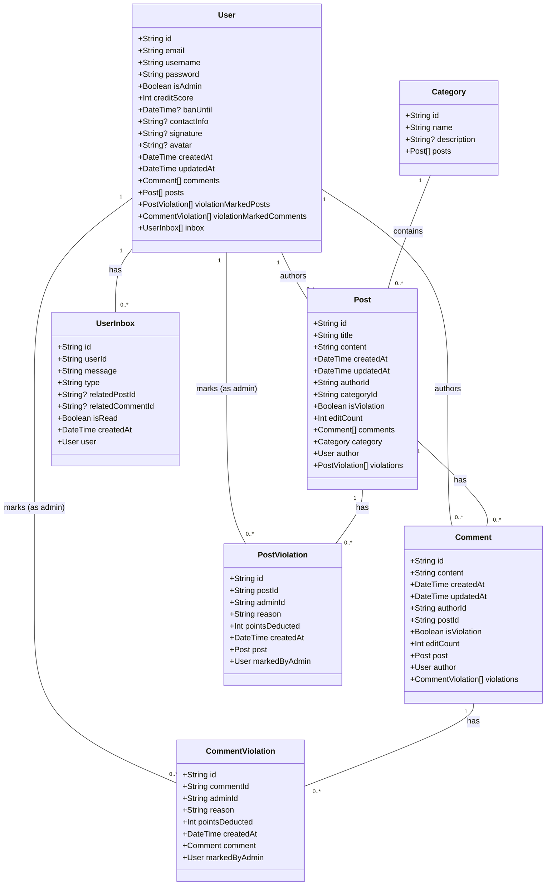

**描述:**
基于 Prisma Schema 的主要实体类及其关系。

---

## 4. 实体关系图 (ERD - 可选)

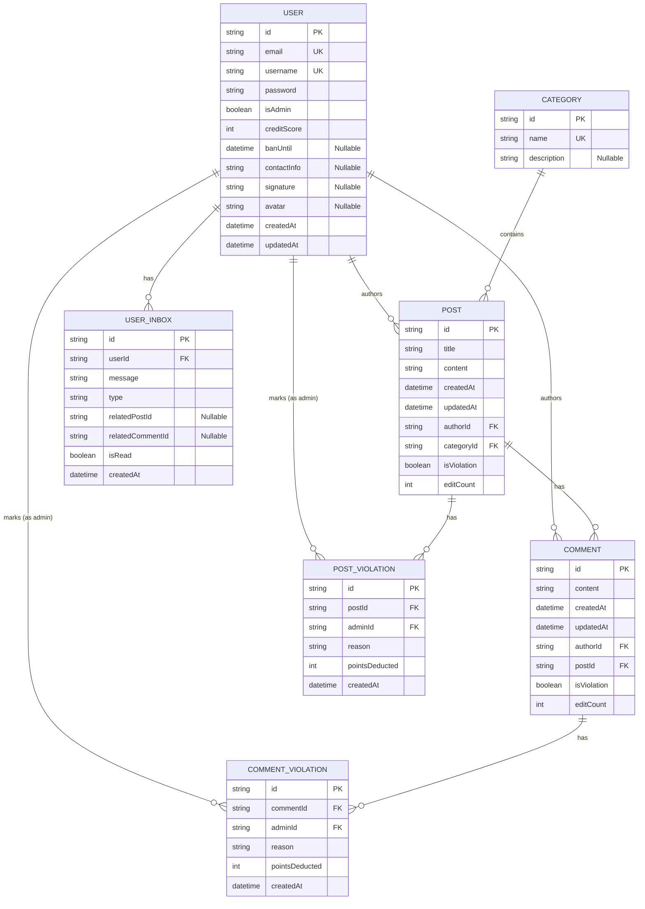

**描述:**
数据库实体及其关系图，基于 Prisma Schema。

---

## 5. 数据库结构

### User 表
| 字段名 | 类型 | 说明 |
| --- | --- | --- |
| id | String | 主键，UUID |
| email | String | 唯一，用户邮箱 |
| username | String | 唯一，用户名 |
| password | String | 密码（已加密） |
| isAdmin | Boolean | 是否为管理员，默认 false |
| creditScore | Int | 信用分数，默认 100 |
| banUntil | DateTime? | 封禁截止时间，可为空 |
| contactInfo | String? | 联系信息，可为空 |
| signature | String? | 个性签名，可为空 |

---

| 字段名 | 类型 | 说明 |
| --- | --- | --- |
| avatar | String? | 头像URL，可为空 |
| createdAt | DateTime | 创建时间 |
| updatedAt | DateTime | 更新时间 |
| comments | Comment[] | 关联的评论 |
| posts | Post[] | 关联的帖子 |
| violationMarkedPosts | PostViolation[] | 作为管理员标记的违规帖子 |
| violationMarkedComments | CommentViolation[] | 作为管理员标记的违规评论 |
| inbox | UserInbox[] | 用户收件箱 |

---

### Category 表
| 字段名 | 类型 | 说明 |
| --- | --- | --- |
| id | String | 主键，UUID |
| name | String | 唯一，分类名称 |
| description | String? | 分类描述，可为空 |
| posts | Post[] | 关联的帖子 |
---

### Post 表
| 字段名 | 类型 | 说明 |
| --- | --- | --- |
| id | String | 主键，UUID |
| title | String | 帖子标题 |
| content | String | 帖子内容 |
| createdAt | DateTime | 创建时间 |
| updatedAt | DateTime | 更新时间 |
| authorId | String | 外键，关联User表 |
| categoryId | String | 外键，关联Category表 |
| isViolation | Boolean | 是否被标记为违规，默认 false |
| editCount | Int | 编辑次数，默认 0 |

---

| 字段名 | 类型 | 说明 |
| --- | --- | --- |
| comments | Comment[] | 关联的评论 |
| category | Category | 关联的分类 |
| author | User | 关联的作者 |
| violations | PostViolation[] | 违规记录 |

---

### Comment 表
| 字段名 | 类型 | 说明 |
| --- | --- | --- |
| id | String | 主键，UUID |
| content | String | 评论内容 |
| createdAt | DateTime | 创建时间 |
| updatedAt | DateTime | 更新时间 |
| authorId | String | 外键，关联User表 |
| postId | String | 外键，关联Post表 |
| isViolation | Boolean | 是否被标记为违规，默认 false |
| editCount | Int | 编辑次数，默认 0 |
| post | Post | 关联的帖子 |

---

| 字段名 | 类型 | 说明 |
| --- | --- | --- |
| author | User | 关联的作者 |
| violations | CommentViolation[] | 违规记录 |

---

### PostViolation 表
| 字段名 | 类型 | 说明 |
| --- | --- | --- |
| id | String | 主键，UUID |
| postId | String | 外键，关联Post表 |
| adminId | String | 外键，关联User表（管理员） |
| reason | String | 违规原因 |
| pointsDeducted | Int | 扣除的信用分数 |
| createdAt | DateTime | 创建时间 |
| post | Post | 关联的帖子 |
| markedByAdmin | User | 关联的管理员 |

注：每个帖子只能被同一管理员标记一次违规（postId和adminId的组合唯一）

---

### CommentViolation 表
| 字段名 | 类型 | 说明 |
| --- | --- | --- |
| id | String | 主键，UUID |
| commentId | String | 外键，关联Comment表 |
| adminId | String | 外键，关联User表（管理员） |
| reason | String | 违规原因 |
| pointsDeducted | Int | 扣除的信用分数 |
| createdAt | DateTime | 创建时间 |
| comment | Comment | 关联的评论 |
| markedByAdmin | User | 关联的管理员 |

注：每条评论只能被同一管理员标记一次违规（commentId和adminId的组合唯一）

---

### UserInbox 表
| 字段名 | 类型 | 说明 |
| --- | --- | --- |
| id | String | 主键，UUID |
| userId | String | 外键，关联User表 |
| message | String | 消息内容 |
| type | String | 消息类型（post_violation/comment_violation/system等） |
| relatedPostId | String? | 相关帖子ID，可为空 |
| relatedCommentId | String? | 相关评论ID，可为空 |
| isRead | Boolean | 是否已读，默认 false |
| createdAt | DateTime | 创建时间 |
| user | User | 关联的用户 |

---

